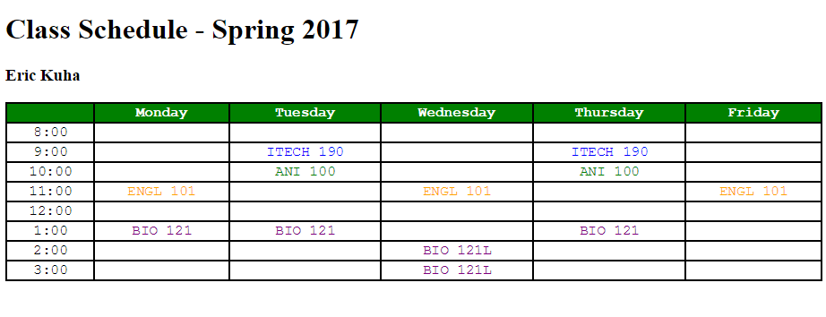

# Introduction to Computer Science - Fall 2017

## Lab 2 - A Table For One

**Purpose:** This purpose of this lab is to expand on basic _HTML_, adding use of tables and inline style attributes.

**Instructions:** Create an web page which will outline a fictional student class schedule. The columns should be the days of the week, and the rows should be the hours of the day. Tags you should utilize include &lt;table&gt;, &lt;tr&gt;, &lt;th&gt;, and &lt;td&gt;. You should also use appropriate inline and embedded styles, as discussed in class. Here is the schedule that you will render:

* ANI 100 - T,Th - 10am-11am
* BIO 121 - M,T,Th - 1pm-2pm
* BIO 121L Lab - W - 2pm-4pm
* ITECH 190 - T,Th - 9am-10am
* ENGL 101 - M,W,F - 11am-12pm

An example of what the final result might look like:

